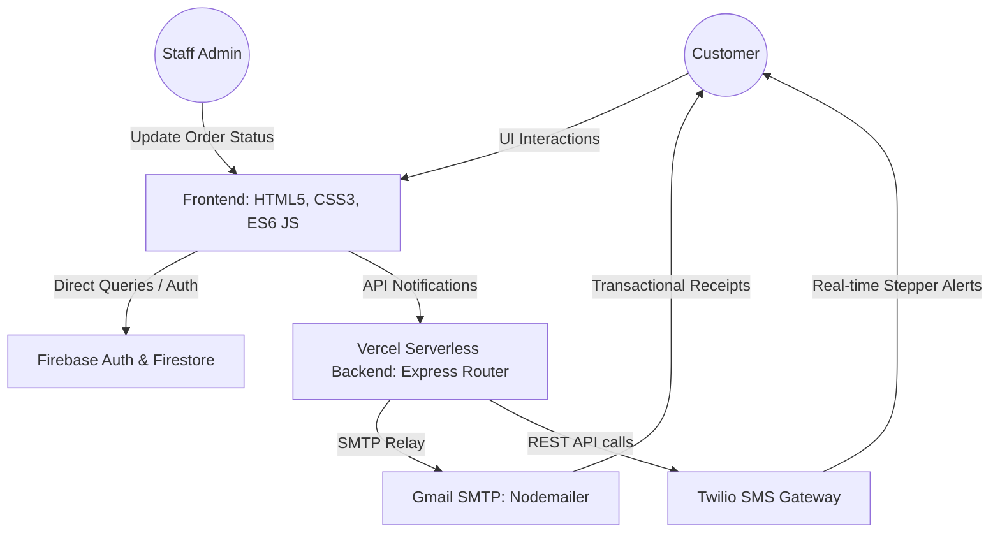

# Mercury Dry Cleaners — Product Launch & System Architecture Report

This report provides a comprehensive technical overview of the digital platform designed and built for **Mercury Dry Cleaners** in Delhi. It covers the system architecture, database design, core application features, external API integrations, and environment configurations.

---

## 1. Executive Summary

Mercury Dry Cleaners is a modern, premium fabric care startup serving the Delhi region. The web application provides a frictionless booking and real-time tracking interface for customers, paired with a centralized management dashboard for admin operators. 

*   **Production URL:** [https://mercury-dry-cleaners.vercel.app](https://mercury-dry-cleaners.vercel.app)
*   **Source Control:** Managed via GitHub.
*   **Hosting & Deployment:** Serverless Node.js architecture deployed on Vercel.
*   **Database & Auth Provider:** Google Firebase Suite (Authentication + Cloud Firestore).

---

## 2. System Architecture



### A. Frontend Layer
*   **Technologies:** Vanilla HTML5, Vanilla CSS3 (Custom design tokens, glassmorphism layout rules), and ES6 client-side JavaScript.
*   **Responsive Flow:** Grid and Flexbox layouts optimized across mobile viewports, tablets, and desktop displays.
*   **Dynamic UI Components:**
    *   Dynamic price calculator that updates sub-totals in real-time.
    *   Horizontal stepper progress bar representing the cleaning lifecycle stages.
    *   Dynamic initials profile avatar badge on the customer dashboard.

### B. Backend API Layer
*   **Technologies:** Node.js, Express.js Router.
*   **Routing Architecture:** Configured via `vercel.json` to handle serverless executions. All requests to `/api/(.*)` are forwarded to a unified Express entry point (`api/index.js` which mounts `server.js`).
*   **Notification Engine:** Handles the heavy lifting of calling external communications APIs asynchronously to keep client response times fast.

### C. Database Layer (Cloud Firestore)
The database operates on a serverless NoSQL schema containing three primary collections:
1.  **`users`**: Stores authenticated profile records.
    *   *Schema:* `name` (string), `email` (string), `phone` (string), `createdAt` (timestamp).
2.  **`orders`**: Active checkout bookings containing invoicing lines.
    *   *Schema:* `orderId` (string), `userId` (string/null), `customerName` (string), `email` (string), `phone` (string), `address` (string), `items` (array of objects), `totalAmount` (number), `paymentMethod` (string), `status` (string), `notes` (string), `createdAt` (timestamp).
3.  **`pickups`**: Direct scheduled collections requested from the homepage.
    *   *Schema:* `orderId` (string), `userId` (string/null), `customerName` (string), `email` (string), `phone` (string), `pickupDate` (string), `pickupTime` (string), `garmentCount` (number), `garmentTypes` (array), `specialInstructions` (string), `pickupFee` (number), `status` (string), `createdAt` (timestamp).

---

## 3. Core Capabilities & Features

### 📍 A. Automatic Geolocation Address Autofill
Instead of forcing customers to type long addresses, the checkout screen (`order.html`) features a **"📍 Autofill Location"** option:
1.  Requests access to the browser's native **HTML5 Geolocation API**.
2.  Passes latitude and longitude coordinates to OpenStreetMap's reverse-geocoding API (`Nominatim`).
3.  Resolves coordinates to a structured street address and inputs it into the form automatically.
4.  Includes graceful error fallbacks for location permissions or device compatibility issues.

### 📊 B. Interactive Stepper Timeline Tracking
The status detail screen (`track.html`) features a dynamic progress tracker that moves through five stages:
1.  **Scheduled:** Order received, pickup vehicle dispatched.
2.  **Picked Up:** Clothes retrieved by courier.
3.  **In Cleaning:** Clothes undergoing eco-friendly solvent washing.
4.  **Ready:** Ironed, packaged, and inspected for quality.
5.  **Completed:** Delivered back to the customer.

Each stage is animated with distinct border status pills and glowing pulsing elements representing the active cleaning stage.

---

## 4. Integration Gateways

### ✉️ A. Nodemailer SMTP (Email System)
Utilizes the secure, SSL-encrypted Google SMTP servers to route transaction alerts:
*   **Server Host:** `smtp.gmail.com` | **Port:** `465` (SSL)
*   **Auth Protocol:** Authenticates using `GMAIL_USER` and a 16-character google **App Password** (`GMAIL_APP_PASSWORD`) bypassing 2FA challenge screens.
*   **Recipients:** Dispatching triggers two emails simultaneously:
    1.  A professional HTML receipt detailing items, totals, and tracking codes directly to the **Customer**.
    2.  A system alert copy sent to the **Operations Admin** (`naveensethi2007@yahoo.com`) containing pickup address details for routing.

### 💬 B. Twilio API (SMS Gateway)
Utilizes Twilio's REST API endpoint client to dispatch SMS text alerts directly to Indian mobile phone numbers:
*   **Auth Protocol:** Authenticates via `TWILIO_ACCOUNT_SID` and `TWILIO_AUTH_TOKEN`.
*   **Formatting:** Auto-normalizes local 10-digit telephone numbers to standard international formats (prepending `+91`) before firing request protocols.
*   **Triggers:** Dispatches automated texts when:
    *   A pickup is scheduled.
    *   An order is placed.
    *   An admin updates order status in the portal (keeping customer steps aligned).

---

## 5. Deployment & Configuration

### A. Environment Configuration (`.env`)
Create a `.env` file at the root of the project containing these key definitions:
```env
# Server
PORT=3000

# Firebase SDK Client Keys
FIREBASE_API_KEY=your_firebase_api_key_here
FIREBASE_AUTH_DOMAIN=your_firebase_auth_domain_here
FIREBASE_PROJECT_ID=your_firebase_project_id_here
FIREBASE_APP_ID=your_firebase_app_id_here

# Nodemailer Outbound Config
GMAIL_USER=your_gmail_sender_username@gmail.com
GMAIL_APP_PASSWORD=your_16_character_app_password_here

# Twilio SMS Config
TWILIO_ACCOUNT_SID=your_twilio_sid_here
TWILIO_AUTH_TOKEN=your_twilio_auth_token_here
TWILIO_PHONE_NUMBER=your_twilio_virtual_phone_number
```

### B. Vercel Production Deployment
Deploy updates using the Vercel CLI tool from the command line:
```bash
# Deploy changes directly to production
npx vercel --prod
```
Vercel automatically compiles your functions and mounts the static resources located inside `/public` globally.
